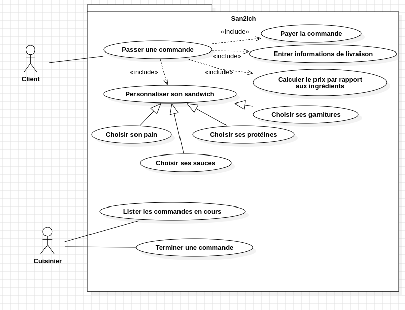
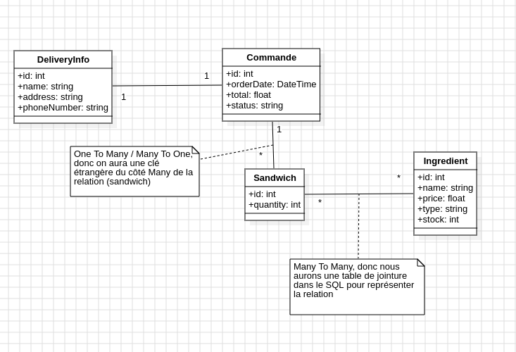

# SQL

Projet pour voir MySQL/MariaDB

## Exercices
### Bases de la syntaxe avec des Personnes et des adresses 

#### Sélections en folie ([fichier sql](exo-select.sql))
1. Dans un fichier SQL à part qu'on va appeler exo-select.sql par exemple (si vous voulez rester dans le même fichier, peu importe en vrai)
2. Faire un ou des insert pour rajouter 2 personnes qui ont comme name 'Sakhri', 2 personnes qui ont comme first name 'Lisa' et dans le lot, 2 qui ont plus de 60 ans, et une personne bonus en plus pour le plaisir
3. Faire une requête pour récupérer la personne qui a l'id 3
4. Faire une requête pour récupérer les personnes dont le first_name est Lisa
5. Faire une requête pour récupérer les personnes qui ont plus de 50 ans
6. Faire une requête pour récupérer les personnes qui ont comme name Sakhri et qui ont moins de 60 ans
7. Faire une requête pour récupérer les personnes qui ne s'appellent pas Lisa
8. Faire une requête pour récupérer les personnes qui ont entre 30 et 60 ans
9. Faire une requête pour récupérer les pesronnes dont le first name commence par un L (il faudra utiliser le LIKE pour ça, je vous laisse chercher la doc)
10. Utiliser le CONCAT dans un SELECT pour afficher une colonne full_name qui sera une concaténation du first_name et du name (pareil, je vous laisse chercher la doc)
**Bonus (plus compliqué)** Récupérer les personnes qui n'étaient pas nées en 1995 (et que la requête marche même si on est pas en 2024)

#### Order et Limit
1. En utilisant le ORDER BY récupérer les personnes ordonnées par leur name de A à Z
2. En utilisant le ORDER BY toujours, récupérer les personnes de la plus jeune à la moins jeune
3. En utilisant le LIMIT en plus du ORDER BY, afficher les 3 personnes les plus agées
4. En utilisant le ORDER BY aller chercher les personnes avec le first_name de A à Z en premier et de la plus agée à la moins agée en deuxième (même requête, même order by, 2 critères)

### Relations entre tables
#### Select Jointure
1. Faire une requête qui va récupérer toutes les addresses de la person 5
2. Faire une requête pour récupérer le name des persons qui possèdent une address à Grenoble
3. Faire une requête pour récupérer les addresses qui appartiennent à la famille Sakhri
4. Faire une requête pour récupérer les addresses qui appartiennent aux personnes avec le prénom Lisa et situées dans le 38
5. Faire une requête qui récupère les persons de la plus âgée à la moins âgée qui ont une address dans une rue (plutôt qu'une avenue ou un boulevard, un chemin etc.)
6. Faire une requête pour récupérer les persons qui n'ont pas d'address
**Bonus**: Faire une requête de recherche qui va sortir toutes les personnes qui ont le terme `on` n'importe où dans leur nom/prénom/addresse

#### Table de jointure
1. Dans le database.sql, créer une nouvelle table skill qui aura un id comme d'hab et une colonne label en varchar not null
2. Créer également une table de jointure person_skill (qui se create comme une table classique en vrai) qui aura 2 colonnes : un person_id et un skill_id
3. Déclarer ces deux colonnes en foreign key vers les 2 tables person et skill
4. Déclarer également une clé primaire composite en rajoutant cette ligne dans le CREATE TABLE à la fin : PRIMARY KEY (person_id,skill_id)
5. Faire des INSERT INTO skill pour rajouter les skills 'HTML/CSS', 'JS', 'Git', 'PHP', 'MySQL', puis des INSERT INTO person_skill pour assigner différents skills à différentes personnes

#### Requête multi jointure
1. Faire une requête pour afficher les persons qui ont comme skill 'PHP' (il va donc falloir faire 2 LEFT JOIN, avec 2 ON pour récupérer 3 tables en même temps : person -> person_skill -> skill. Et un p'tit where à la fin)
2. (désolé) Faire une requête qui va afficher les persons qui savent faire du Git et qui ont une address à Grenoble (on va donc avoir 3 LEFT JOIN, pasque pourquoi pas)
3. En se basant sur la requête d'avant, afficher les labels des skills connus des persons qui ont une address à grenoble (distinct ?)

### Aggrégations

#### Requêtes avec GROUP BY
1. Faire une requête pour afficher l'âge moyen des persones qui ont le même prénom
2. Faire une requête pour afficher l'âge de la plus vieille personne de chaque famille
3. Faire une requête avec jointure pour afficher les personnes et le nombre d'adresses que chacune possède
4. En se basant sur la requête précédente, faire en sorte de n'afficher que les personnes qui ont 2 adresses ou plus (il faudra faire cette condition avec un HAVING après le GROUP BY plutôt qu'un WHERE)
5. Faire une requête avec double jointures pour afficher les personnes et la liste de leurs skills concaténés dans une même chaîne de caractère
6. Faire une requête avec double jointures pour afficher les skills, combien de personne possède chaque skill et l'âge moyen et maximum des personnes qui les ont
**Bonus** Faire un classement des villes avec le plus de skills pratiqués (et quel est le skill le plus pratiqué ? Pas certain de si c'est possible en une seule requête ça) 

### Modification

1. Dans un fichier à part qu'on va appeler modif-table.sql, utiliser un ALTER TABLE pour rajouter une nouvelle colonne birthdate de type DATE dans la person
2. Faire une requête update pour essayer de remplir la colonne birthdate des gens existants en mettant une birthdate par défaut au 1er janvier et comme année, l'année de maintenant moins l'age ? (il va falloir assigner comme birthdate l'année actuelle moins l'age, et la CONCAT à '-01-01')
3. Faire un autre alter table pour supprimer la colonne age

### Mise en Pratique (commande de sandwich)

#### Conception
À partir de ce diagramme de use case, créer le diagramme d'entité pour lister les choses qui devront persister

#### Création des tables

À partir de ce diagramme, identifier où seront les clés étrangères et tables de jointures puis :

1. Créer une nouvelle base de données dam_sandwich
2. Créer un fichier database-sandwich.sql lié à cette base de données
3. Dans ce fichier, faire les DROP et CREATE TABLE pour chacune des entités avec leurs colonnes, clés étrangères, constraints etc.
4. Ajouter des INSERT INTO pour avoir des données de tests : une liste d'ingrédients de différents types (bread, protein, sauce, garnish), 3-4 commandes avec différents status (delivered, awaiting, in progress), 1 ou 2 sandwich par commande et donc des liens avec des ingrédients pour chaque sandwich